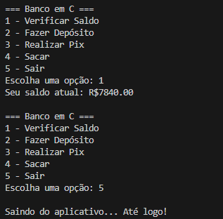

# Bank-in-C-
This is a small little project that simulates a bank's app. Just for learning purpose. 

Mini aplicativo de banco feito em C, criado para fins de estudo e prática. 
Este programa simula operações básicas bancárias como verificar saldo, fazer depósitos, transferir via pix e realizar saques. 

Funcionalidades: 
- Verificar Saldo
- Fazer Depósito
- Realizar Pix (com chave fixa para simulação)
- Realizar Saques
- Menu interativo com repetição até o usuário sair. 

